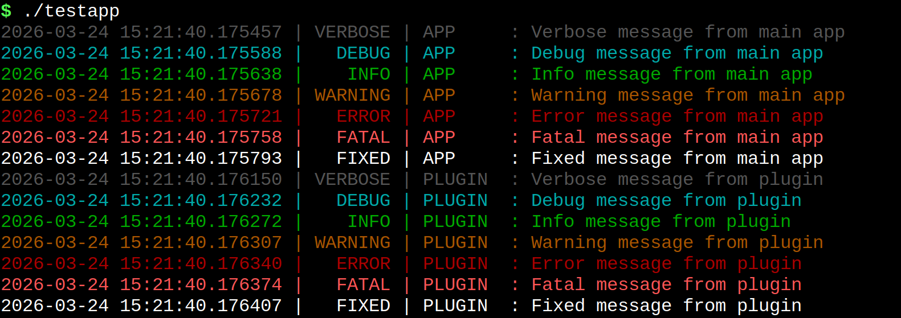

# uLogger

A lightweight, header-only C++20 logging library providing structured, timestamped, and optionally color-coded log output to the console and/or a file — with zero external dependencies.

---

<br>

---

## Table of Contents

- [Features](#features)
- [Requirements](#requirements)
- [Integration](#integration)
- [Quick Start](#quick-start)
- [Log Levels](#log-levels)
- [Configuration](#configuration)
  - [LOG\_INIT](#log_init)
  - [Runtime Configuration](#runtime-configuration)
  - [File Logging](#file-logging)
- [Logging Macros Reference](#logging-macros-reference)
  - [LOG\_PRINT](#log_print)
  - [Type-Specific Append Macros](#type-specific-append-macros)
  - [Hex Formatting Macros](#hex-formatting-macros)
  - [Separator Macros](#separator-macros)
- [Output Format](#output-format)
- [Advanced Usage](#advanced-usage)
  - [Multiple Logger Instances](#multiple-logger-instances)
  - [Custom Severity Thresholds](#custom-severity-thresholds)
  - [Using LOG\_FIXED and LOG\_EMPTY](#using-log_fixed-and-log_empty)
- [Thread Safety](#thread-safety)
- [Buffer Behaviour and Limits](#buffer-behaviour-and-limits)
- [API Reference](#api-reference)

---

## Features

- **Header-only** — drop `uLogger.hpp` into your project and `#include` it.
- **Eight log levels** — `VERBOSE`, `DEBUG`, `INFO`, `WARNING`, `ERROR`, `FATAL`, `FIXED`, and `EMPTY`.
- **Independent severity thresholds** for console and file output.
- **ANSI color-coded** console output (can be disabled).
- **Microsecond-precision timestamps**, with optional date prefix.
- **File logging** with auto-generated or custom filenames.
- **Type-safe append macros** covering all common C++ primitive types, pointers, hex formatting, booleans, strings, `std::string`, `std::string_view`, `char` arrays, and `std::array<char, N>`.
- **Thread-safe** — all print and file operations are protected by a `std::mutex`.
- **Overflow-safe** internal 1 KB buffer with graceful truncation.
- **C++20 concepts** enforce type correctness at compile time.

---

## Requirements

| Requirement | Version |
|---|---|
| C++ Standard | C++20 or later |
| Compiler | GCC 10+, Clang 12+, MSVC 19.29+ (VS 2019 16.9+) |
| OS | Linux, macOS, Windows |

---

## Integration

uLogger is a single-header library. Simply copy `uLogger.hpp` into your project and include it:

```cpp
#include "uLogger.hpp"
```

No build system changes, no linking steps, no dependencies beyond the C++ standard library.

---

## Quick Start

```cpp
#include "uLogger.hpp"

int main()
{
    // Initialize: console threshold, file threshold, file logging, colors, include date
    LOG_INIT(LOG_DEBUG, LOG_INFO, false, true, false);

    LOG_PRINT(LOG_INFO,
        LOG_STRING("Application started.");
        LOG_STRING("Version:"); LOG_INT32(3);
    );

    int sensor_value = 42;
    LOG_PRINT(LOG_DEBUG,
        LOG_STRING("Sensor reading:"); LOG_INT32(sensor_value);
    );

    float temperature = 23.7f;
    LOG_PRINT(LOG_WARNING,
        LOG_STRING("High temperature:"); LOG_FLOAT(temperature); LOG_STRING("°C");
    );

    LOG_PRINT(LOG_ERROR,
        LOG_STRING("Failed to open device."); LOG_STRING("Error code:"); LOG_INT32(-5);
    );

    LOG_DEINIT();
    return 0;
}
```

**Console output (with colors):**
```
12:00:00.123456 |    INFO | Application started. Version: 3
12:00:00.123512 |   DEBUG | Sensor reading: 42
12:00:00.123601 | WARNING | High temperature: 23.70000000 °C
12:00:00.123689 |   ERROR | Failed to open device. Error code: -5
```

---

## Log Levels

Levels are defined in the `LogLevel` enum and expose convenient `inline constexpr` aliases:

| Alias | Enum Value | Color | Typical Use |
|---|---|---|---|
| `LOG_VERBOSE` | `EC_VERBOSE` | Gray | Granular trace output |
| `LOG_DEBUG` | `EC_DEBUG` | Cyan | Development diagnostics |
| `LOG_INFO` | `EC_INFO` | Green | Normal operational messages |
| `LOG_WARNING` | `EC_WARNING` | Yellow | Non-critical anomalies |
| `LOG_ERROR` | `EC_ERROR` | Red | Recoverable errors |
| `LOG_FATAL` | `EC_FATAL` | Bright Red | Unrecoverable failures |
| `LOG_FIXED` | `EC_FIXED` | Bright White | Persistent status / always-on messages |
| `LOG_EMPTY` | `EC_EMPTY` | — | Raw output with no timestamp or severity prefix; an empty message produces a blank line |

Severity thresholds are compared numerically — a message is only printed if its level is **≥** the configured threshold. `LOG_FIXED` intentionally sits above `LOG_FATAL`, making it useful for messages that must always appear regardless of the active threshold. `LOG_EMPTY` bypasses the threshold check and prefix entirely.

---

## Configuration

### LOG_INIT

Initialise the logger once at program startup, before any `LOG_PRINT` calls:

```cpp
LOG_INIT(
    LOG_DEBUG,   // Console severity threshold
    LOG_WARNING, // File severity threshold
    true,        // Enable file logging
    true,        // Enable ANSI color output
    true         // Include date in timestamp (YYYY-MM-DD HH:MM:SS.xxxxxx)
);
```

Only messages at or above the respective threshold reach each output channel.

### Runtime Configuration

All settings can be changed at any point after initialisation by calling methods directly on the global logger instance:

```cpp
auto logger = getLogger();

logger->setConsoleThreshold(LOG_WARNING);   // Suppress VERBOSE/DEBUG/INFO on console
logger->setFileThreshold(LOG_VERBOSE);      // Write everything to file
logger->setColoredLogs(false);              // Disable ANSI colors
logger->setIncludeDate(true);               // Add YYYY-MM-DD to timestamps
```

### File Logging

Enable file logging with an auto-generated timestamped filename:

```cpp
getLogger()->enableFileLogging();           // Creates e.g. "log_20240315_142500.txt"
```

Or specify a path explicitly:

```cpp
getLogger()->enableFileLogging("run_001.log");
```

The file is opened in **append** mode, so successive runs accumulate in the same file when a fixed name is used. To stop file logging cleanly:

```cpp
getLogger()->disableFileLogging();
// or use the convenience macro:
LOG_DEINIT();
```

Check the current state:

```cpp
if (getLogger()->isFileLoggingEnabled()) {
    // file is open and active
}
```

---

## Logging Macros Reference

### LOG_PRINT

The primary logging macro. It sets the severity level, evaluates all append statements in its body, then flushes the buffer to the configured outputs atomically.

```cpp
LOG_PRINT(SEVERITY, <one or more append macros>);
```

Each append statement inside `LOG_PRINT` adds a token to the internal buffer, followed by a space. The buffer is flushed and reset after every `LOG_PRINT` call.

```cpp
LOG_PRINT(LOG_INFO,
    LOG_STRING("Connection established.");
    LOG_STRING("Host:"); LOG_STRING(hostname.c_str());
    LOG_STRING("Port:"); LOG_UINT16(port);
);
```

### Type-Specific Append Macros

These macros append a single value to the active log buffer. They must always appear inside a `LOG_PRINT(...)` block.

| Macro | Accepted Type | Example |
|---|---|---|
| `LOG_STRING(V)` | `const char*`, `std::string`, `std::string_view` | `LOG_STRING("hello")` |
| `LOG_BOOL(V)` | any value castable to `bool` | `LOG_BOOL(flag)` → `true` / `false` |
| `LOG_CHAR(C)` | `char` | `LOG_CHAR('A')` |
| `LOG_INT8(V)` | `int8_t` | `LOG_INT8(delta)` |
| `LOG_INT16(V)` | `int16_t` | `LOG_INT16(offset)` |
| `LOG_INT32(V)` | `int32_t` | `LOG_INT32(count)` |
| `LOG_INT64(V)` | `int64_t` | `LOG_INT64(timestamp_us)` |
| `LOG_INT(V)` | `int` | `LOG_INT(errno_val)` |
| `LOG_UINT8(V)` | `uint8_t` | `LOG_UINT8(byte)` |
| `LOG_UINT16(V)` | `uint16_t` | `LOG_UINT16(port)` |
| `LOG_UINT32(V)` | `uint32_t` | `LOG_UINT32(id)` |
| `LOG_UINT64(V)` | `uint64_t` | `LOG_UINT64(size)` |
| `LOG_SIZET(V)` | `size_t` | `LOG_SIZET(vec.size())` |
| `LOG_FLOAT(V)` | `float` | `LOG_FLOAT(voltage)` |
| `LOG_DOUBLE(V)` | `double` | `LOG_DOUBLE(lat)` |
| `LOG_PTR(PTR)` | any non-`char` pointer | `LOG_PTR(obj_ptr)` |

### Hex Formatting Macros

Append unsigned integer values as zero-padded hexadecimal strings:

| Macro | Width | Example Output |
|---|---|---|
| `LOG_HEX8(V)` | `0xXX` | `0xFF` |
| `LOG_HEX16(V)` | `0xXXXX` | `0x04D2` |
| `LOG_HEX32(V)` | `0xXXXXXXXX` | `0xDEADBEEF` |
| `LOG_HEX64(V)` | `0xXXXXXXXXXXXXXXXX` | `0x00000000DEADBEEF` |
| `LOG_HEXSIZET(V)` | Platform-width | `0x00007FFF…` |

```cpp
uint32_t reg = 0xCAFEBABE;
LOG_PRINT(LOG_DEBUG,
    LOG_STRING("Register value:"); LOG_HEX32(reg);
);
// Output: 12:00:00.000000 |   DEBUG | Register value: 0xCAFEBABE
```

### Separator Macros

Print a horizontal rule to the console to visually separate sections of output. Separators bypass the severity threshold and always print immediately.

```cpp
LOG_SEP();                          // Default magenta separator
LOG_SEPARATOR("\033[36m");          // Cyan separator using ANSI escape code
```

---

## Output Format

A standard log line follows this format:

```
HH:MM:SS.xxxxxx | SEVERITY | <message tokens...>
```

With date enabled (`setIncludeDate(true)`):

```
YYYY-MM-DD HH:MM:SS.xxxxxx | SEVERITY | <message tokens...>
```

`LOG_EMPTY` lines omit the timestamp and severity entirely:

```
<raw message content>
```

An `LOG_EMPTY` call with no appended tokens produces a blank line, which is useful for visually grouping related output.

---

## Advanced Usage

### Multiple Logger Instances

By default, all macros operate on the global `log_local` instance. You can create separate loggers for different subsystems and switch between them using `setLogger`:

```cpp
// Create a dedicated logger for a network subsystem
auto networkLogger = std::make_shared<LogBuffer>();
networkLogger->setConsoleThreshold(LOG_ERROR);
networkLogger->enableFileLogging("network.log");

// Replace the global logger
setLogger(networkLogger);

LOG_PRINT(LOG_INFO, LOG_STRING("This goes to network.log"););

// Restore the original logger
setLogger(std::make_shared<LogBuffer>());
```

Alternatively, call `LogBuffer` methods directly on any instance — the macros are simply shortcuts to `log_local`:

```cpp
auto subsysLog = std::make_shared<LogBuffer>();
subsysLog->setLevel(LOG_WARNING);
subsysLog->append("Direct append example");
subsysLog->print();
```

### Custom Severity Thresholds

Suppress noisy low-level output in production while writing everything to a file for later analysis:

```cpp
LOG_INIT(LOG_WARNING, LOG_VERBOSE, true, true, true);
// Console: WARNING and above only
// File: everything from VERBOSE upward
```

Bump verbosity at runtime when investigating an issue, without recompilation:

```cpp
getLogger()->setConsoleThreshold(LOG_VERBOSE);
// ... reproduce the issue ...
getLogger()->setConsoleThreshold(LOG_INFO);  // restore
```

### Using LOG_FIXED and LOG_EMPTY

`LOG_FIXED` is always printed regardless of the threshold — useful for startup banners, version lines, or persistent status that must never be suppressed:

```cpp
LOG_PRINT(LOG_FIXED,
    LOG_STRING("=== MyApp v2.4.1 — Build 2024-03-15 ===");
);
```

`LOG_EMPTY` prints raw content (or a blank line) without any prefix, ideal for structured multi-line output or visual spacing:

```cpp
LOG_SEP();
LOG_PRINT(LOG_FIXED, LOG_STRING("System Diagnostics Report"););
LOG_SEP();
LOG_PRINT(LOG_EMPTY, );                              // blank line
LOG_PRINT(LOG_EMPTY, LOG_STRING("CPU:  OK"););
LOG_PRINT(LOG_EMPTY, LOG_STRING("RAM:  OK"););
LOG_PRINT(LOG_EMPTY, LOG_STRING("DISK: WARNING"););
LOG_PRINT(LOG_EMPTY, );                              // blank line
LOG_SEP();
```

---

## Thread Safety

The `print()` method and `enableFileLogging()` / `disableFileLogging()` are all protected by the `LogBuffer::logMutex`. Concurrent `LOG_PRINT` calls from multiple threads will not interleave or corrupt output.

Note that the buffer itself (the sequence of `append` calls inside a `LOG_PRINT` block) is **not** individually locked — the entire `LOG_PRINT` macro expands to a `do { ... } while(0)` block that serialises at `print()`. For correct multi-threaded use, complete `LOG_PRINT` calls (not individual append macros) should be issued from each thread.

---

## Buffer Behaviour and Limits

The internal message buffer is `1024` bytes (defined by `LogBuffer::BUFFER_SIZE`). If a single `LOG_PRINT` block appends more than ~1022 characters, the output will be silently truncated to fit. Each token append adds a trailing space, so the practical capacity per line is approximately **511 tokens of two characters each** for short values, and fewer for longer strings.

For very long messages, break them into multiple `LOG_PRINT` calls.

---

## API Reference

### Free Functions

| Function | Description |
|---|---|
| `getLogger()` | Returns the current global `shared_ptr<LogBuffer>`. |
| `setLogger(ptr)` | Replaces the global logger with the given instance. |
| `log_separator(color)` | Prints a separator line to stdout in the given ANSI color. |
| `toString(LogLevel)` | Returns the string label for a log level (e.g. `"WARNING"`). |
| `getColor(LogLevel)` | Returns the ANSI escape code for a log level. |
| `sizet2loglevel(size_t)` | Converts a numeric index (0–7) to a `LogLevel`; returns `std::nullopt` if out of range. |

### LogBuffer Methods

| Method | Description |
|---|---|
| `setLevel(LogLevel)` | Sets the severity for the next `print()` call. |
| `setConsoleThreshold(LogLevel)` | Sets the minimum level for console output. |
| `setFileThreshold(LogLevel)` | Sets the minimum level for file output. |
| `setColoredLogs(bool)` | Enables or disables ANSI colour codes on the console. |
| `setIncludeDate(bool)` | Includes or omits the date component in timestamps. |
| `enableFileLogging(filename)` | Opens a log file (auto-named if `filename` is empty). Returns `true` on success. |
| `disableFileLogging()` | Flushes and closes the log file. |
| `isFileLoggingEnabled()` | Returns `true` if the file is open and active. |
| `append(value)` | Appends a typed value to the buffer (all primitive types, strings, arrays, pointers). |
| `appendHex(value)` | Appends an unsigned integer as a zero-padded hex string. |
| `print()` | Flushes the buffer to console and/or file, then resets internal state. |
| `reset()` | Clears the buffer without printing. |

### Macros

| Macro | Description |
|---|---|
| `LOG_INIT(CON, FILE, EN, CLR, DATE)` | Initialise the global logger. |
| `LOG_DEINIT()` | Close the log file and clean up. |
| `LOG_PRINT(SEV, ...)` | Log a message at the given severity. |
| `LOG_STRING(V)` | Append a string. |
| `LOG_BOOL(V)` | Append `true` or `false`. |
| `LOG_CHAR(C)` | Append a character. |
| `LOG_INT(V)` / `LOG_INT8` … `LOG_INT64` | Append a signed integer. |
| `LOG_UINT8` … `LOG_UINT64`, `LOG_SIZET` | Append an unsigned integer. |
| `LOG_FLOAT(V)` / `LOG_DOUBLE(V)` | Append a floating-point value (8 decimal places). |
| `LOG_PTR(P)` | Append a pointer address. |
| `LOG_HEX8` … `LOG_HEX64`, `LOG_HEXSIZET` | Append a zero-padded hex value. |
| `LOG_SEP()` | Print a magenta separator line. |
| `LOG_SEPARATOR(COLOR)` | Print a separator line in a custom ANSI color. |
